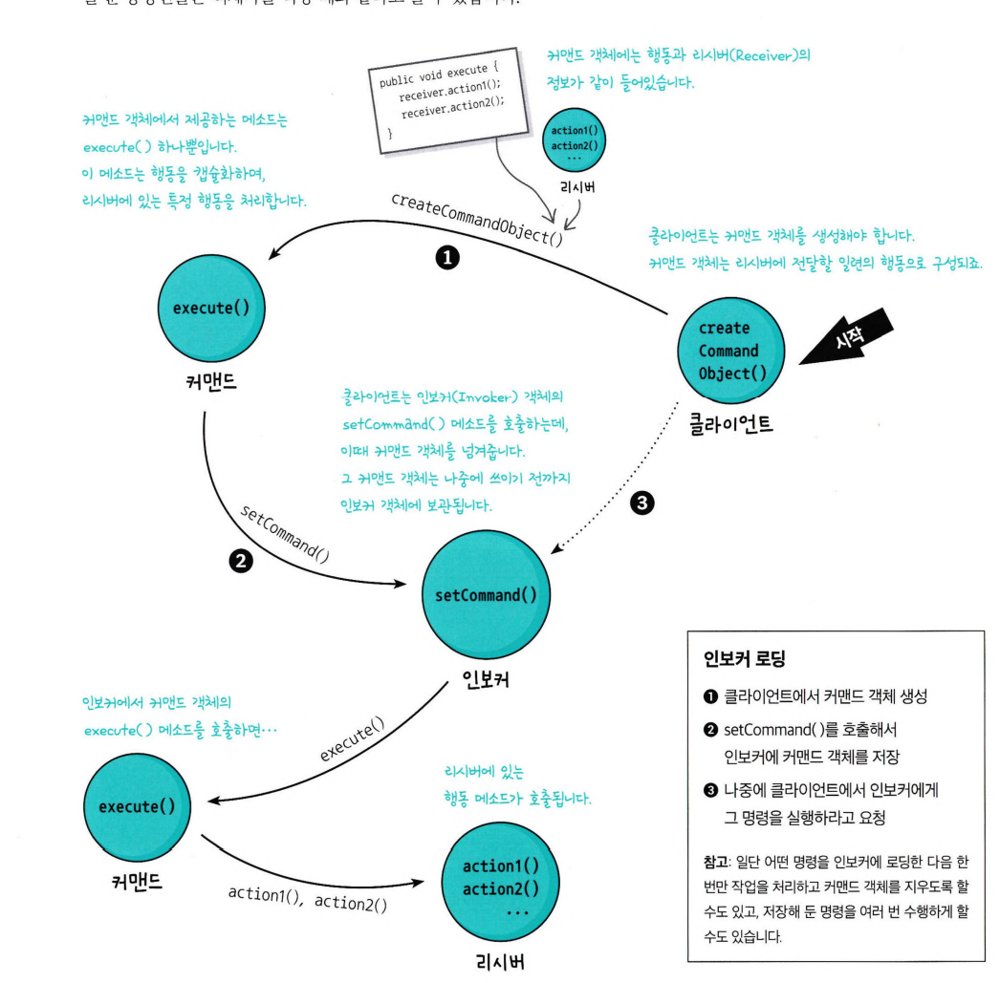
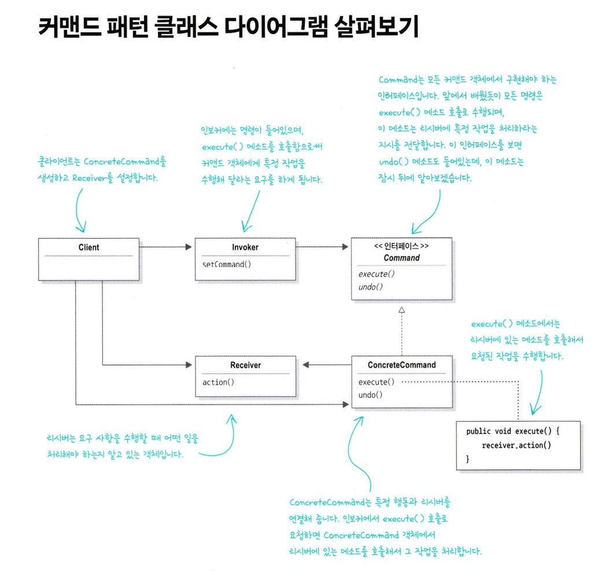

# 커맨드 패턴

- 작업을 요청하는 쪽과 작업을 처리하는 쪽을 분리할 수 있도록 하는 디자인 패턴
- 커맨드 객체를 통해 특정 객체에 관한 특정 작업 요청을 캡슐화할 수 있다 -> 구체적으로 어떤 작업을 해야하는지에 대해 아는 것은 커맨드 객체이다.
- 커맨드 패턴을 사용하면, 요청 내역을 객체로 캡슐화하여 객체를 서로 다른 요청 내역에 따라 매개변수화할 수 있다. -> 요청을 큐에 저장하거나 로그로 기록하거나 작업 취소 기능을 사용할 수 있다.

> 구체적인 커맨드 패턴의 예시

1. createCommandObject() : 클라이언트가 리시버에 전달할 일련의 행동으로 구성된 커맨드 객체를 생성 execute() : 커맨드 객체의 유일한 execute() 메소드로 행동을 캡슐화하여
   리시버의 특정 행동을 처리
2. setCommand() : 클라이언트는 인보커 객체의 setCommand() 메소드를 호출하므로써 커맨드 객체를 넘겨줌
3. execute() -> action() : 인보커에서 커맨드 객체의 execute() 메소드를 호출하면 -> 리시버의 특정 행동 메소드가 호출됨

|    커맨드 패턴    |   식당    |
|:------------:|:-------:|
|   클라이언트 객체   |   고객    |
|    커맨드 객체    |   주문서   |
|    인보커 객체    |   종업원   |
| setCommand() | 주문 수행하기 |
|  execute()   |  주분 받기  |
|    리시버 객체    |   주방장   |
