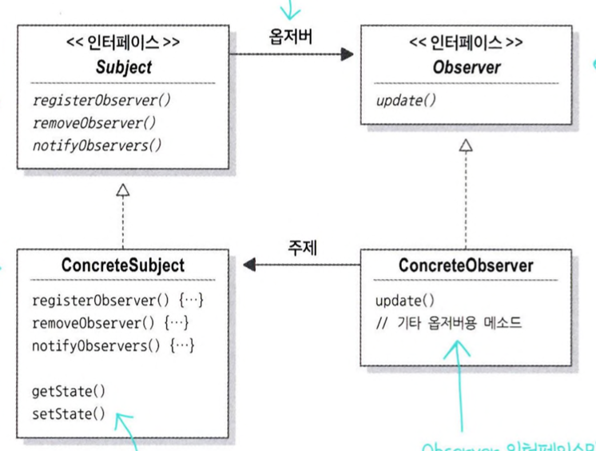

# 2주차 : 옵저버 패턴

# 바뀌는 부분은 캡슐화해야 한다.

```java
public class WeatherData {

  public void measurementsChanged() {
    float temp = getTemp();
    float humidity = getHumidity();
    float pressure = getPressure();

    currentConditionDisplay.update(temp, humidity, pressure);
    statisticsDisplay.update(temp, humidity, pressure);
    forecastDisplay.update(temp, humidity, pressure);
  }
}
```

새로운 디스플레이가 추가될 때마다 코드를 변경해야 한다.

다시 말해서 프로그램이 실행중이라면 디스플레이를 추가하거나 삭제할 수 없다는 한계가 있다.

이를 해결하기 위해 `캡슐화` 가 필요하다.

# 옵저버 패턴

> 한 객체의 상태가 변경되면 그 객체에 의존하는 다른 객체에게 연락이 가고 자동으로 내용이 갱신되는 방식으로 일대다(one-to-many) 의존성을 정의한다.
>



ConcreteSubject

- WeatherData

ConcreteObserver

- CurrentConditionDisplay
- StatisticsDisplay
- ForecastDisplay

## 동작 방식#1 (push)

> subject가 observer로 데이터를 보내는 방법
>

ConcreteSubject가 데이터를 ConcreteObserver에게 전달할 수 있도록 update 메소드를 구현한다.

- ConcreteSubject는 update 메소드의 파라미터로 ConcreteObserver들에게 데이터를 전달한다.

ConcreteSubject의 `List<Observer>` 변수에 ConcreteObserver 객체들을 담아두고, 데이터가 변경되면 한번에 update 메소드를 실행시킨다.

## 동작 방식#2 (pull)

> observer가 subject로부터 데이터를 당겨오는 방법 (대체로 push보다 좋은 방식)
>

ConcreteObserver가 ConcreteSubject의 데이터를 가져올 수 있도록 update 메소드를 구현한다.

- update 메소드는 파라미터를 가지지 않고, ConcreteSubject의 getter 메소드를 통해 데이터를 pull한다.

ConcreteSubject의 `List<Observer>` 변수에 ConcreteObserver 객체들을 담아두고, 데이터가 변경되면 한번에 update 메소드를 실행시킨다.

# 디자인 원칙1 : 느슨한 결합

> 객체들이 상호작용을 하지만 서로를 잘 모르는 관계에 있을 때, 이를 `느슨한 결합`을 이룬다고 한다.

상호작용을 하는 객체 사이에는 가능하면 상호 의존성을 최소화할 수 있는 느슨한 결합을 사용해야한다. 그래야 변경 사항이 생겨도 유연한 객체지향 시스템을 구축할 수 있기 때문이다.
>

옵저버 패턴은 느슨한 결합을 보여주는 예이다.

- 주제(ConcreteSubject)는 옵저버(ConcreteObserver)가 특정 인터페이스(Observer)를 구현한다는 사실만 알고 있다
- 옵저버는 언제든지 새로 추가할 수 있다. (ConcreteObserver 클래스를 추가하면 됨)
- 새로운 형식의 옵저버를 추가할 때도 주제를 변경할 필요 없다
- 주제와 옵저버는 **독립적으로 재사용**할 수 있다
- 주제나 옵저버가 달라져도 **서로에게 영향을 미치지 않는다**
